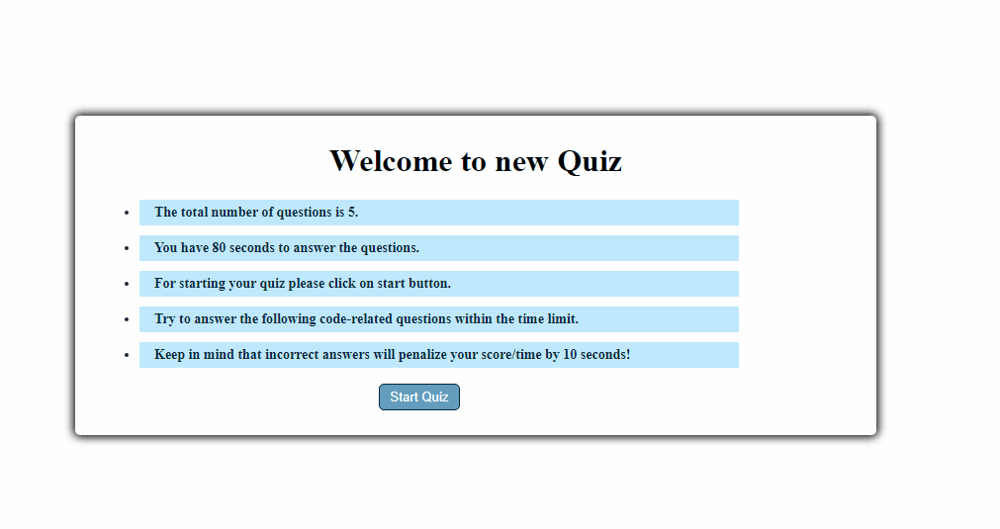

# Code-Quiz

This app is built a timed coding quiz with multiple-choice questions. This app runs in the browser and features dynamically updated HTML and CSS powered by JavaScript code that I wrote. 

## User Story

```
AS A coding boot camp student
I WANT to take a timed quiz on JavaScript fundamentals that stores high scores
SO THAT I can gauge my progress compared to my peers

GIVEN I am taking a code quiz
WHEN I click the start button
THEN a timer starts and I am presented with a question
WHEN I answer a question
THEN I am presented with another question
WHEN I answer a question incorrectly
THEN time is subtracted from the clock
WHEN all questions are answered or the timer reaches 0
THEN the game is over
WHEN the game is over
THEN I can save my initials and my score
```


This project has been deployed to GitHub Pages. To get this project up and running, you can follow the deployment link.

* [GitHub Repository](https://github.com/ebazazzadeh/Code-Quiz)
* [Deployed GitHub IO](https://ebazazzadeh.github.io/Code-Quiz/)




### Prerequisites

To install this application, you will need a text editor. I recommend Visual Studio Code. 


